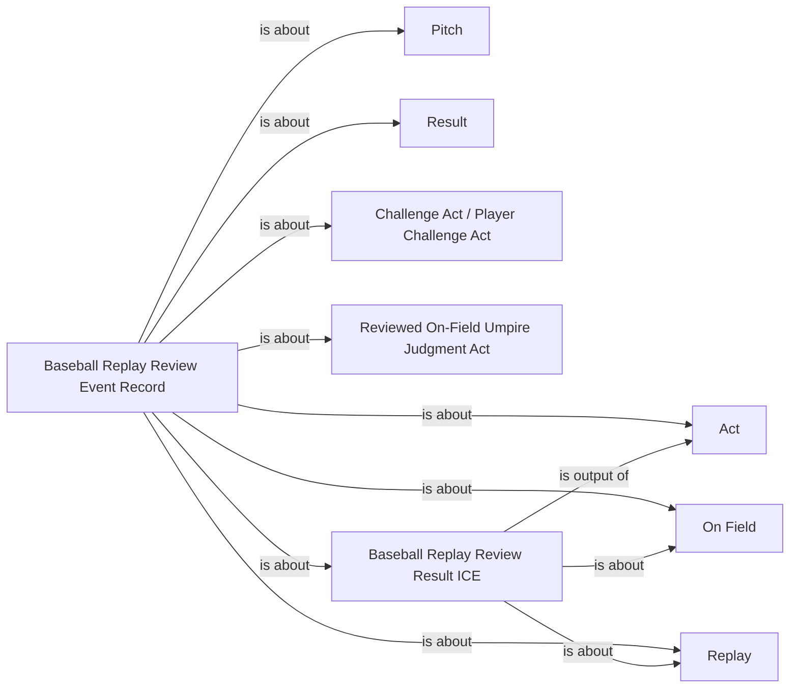

<!-- Generated by scripts/generate_rml_mermaid.py; do not edit. -->
<!-- Mapping SHA-256: 0525c6bf4b5afe22d7f8ed5ae6ba27fe96831e3a0765c0c3bf5a615539bc1189 -->

# Replay review result and record

Review-result information describes the relationship between the two decisions, while a source event record is about the full review pattern, an optional challenge, and the final structured outcome.

This view shows the ontology pattern without MLB JSON paths or RML machinery.

## RML evidence boundary

Generated from: `ReplayReviewResultMap`, `ReviewEventRecordMap`, `ChallengedReviewEventRecordAboutMap`, `PitchReviewEventRecordAboutMap`.
