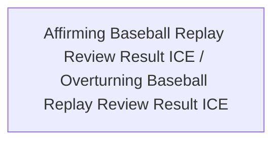

<!-- Generated by scripts/generate_rml_mermaid.py; do not edit. -->
<!-- Mapping SHA-256: 89fae0584eead88666541bd9f84897d45347f7ef9f863ecbfaff003daa8dccf1 -->

# Replay review result classification

Review-result information is classified as affirming or overturning from the source review outcome.

This view shows the ontology pattern without MLB JSON paths or RML machinery.

```mermaid
flowchart LR
    N01["Affirming Baseball Replay Review Result ICE / Overturning Baseball Replay Review Result ICE"]
```

## RML evidence boundary

Generated from: `ReviewAffirmingResultMap`, `ReviewOverturningResultMap`.
