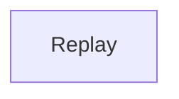

<!-- Generated by scripts/generate_rml_mermaid.py; do not edit. -->
<!-- Mapping SHA-256: ca2bfcd3533f154819be7138ce97981ad9af101d0152bc154d5eac8049dde31a -->

# Replay decision classification

The replay decision is classified as ball, strike, out, or safe from the final structured source state.

This view shows the ontology pattern without MLB JSON paths or RML machinery.

## RML evidence boundary

Generated from: `ReviewFinalBallDecisionMap`, `ReviewFinalStrikeDecisionMap`, `ReviewFinalOutDecisionMap`, `ReviewFinalSafeDecisionMap`.
