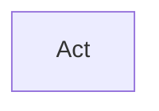

<!-- Generated by scripts/generate_rml_mermaid.py; do not edit. -->
<!-- Mapping SHA-256: eb537822e4bab673851aa84bf233b33843d82c93e6cce031fecfd402d6c46950 -->

# Replay review transition patterns

Each replay-review act receives one explicit ball-to-ball, strike-to-strike, out-to-out, safe-to-safe, ball-to-strike, strike-to-ball, out-to-safe, or safe-to-out classification when the source supports it.

This view shows the ontology pattern without MLB JSON paths or RML machinery.

## RML evidence boundary

Generated from: `ReviewBallToBallActMap`, `ReviewStrikeToStrikeActMap`, `ReviewOutToOutActMap`, `ReviewSafeToSafeActMap`, `ReviewBallToStrikeActMap`, `ReviewStrikeToBallActMap`, `ReviewOutToSafeActMap`, `ReviewSafeToOutActMap`.
