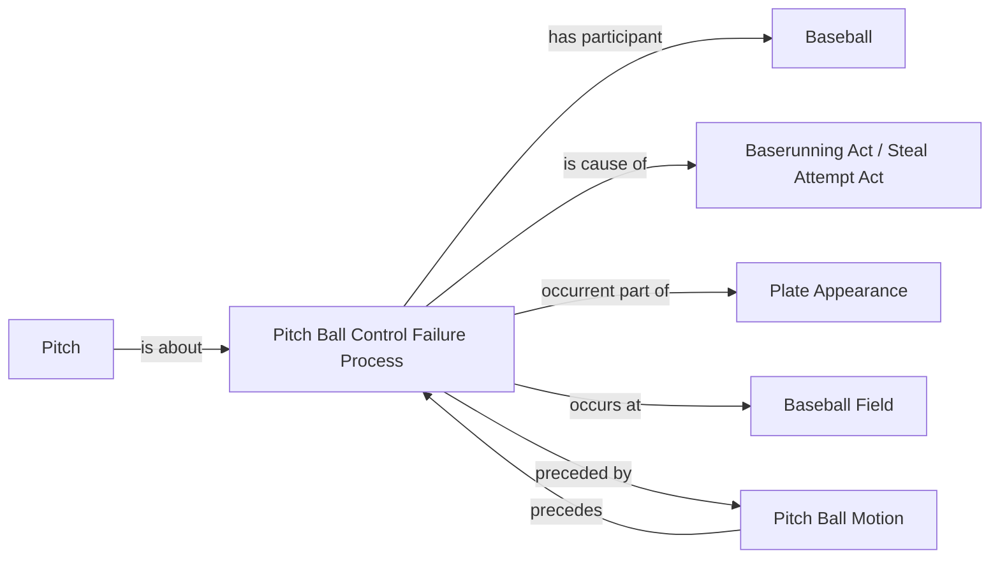

<!-- Generated by scripts/generate_rml_mermaid.py; do not edit. -->
<!-- Mapping SHA-256: 57a5cb1a54e46ee26b27f101cb1468292932df060b1f72c51331c0d029f8c2b5 -->

# Pitch-ball control failure

A pitch-ball motion precedes a distinct physical control failure that involves the same Baseball and may cause source-reported baserunning acts without entailing a scoring classification.

This view shows the ontology pattern without MLB JSON paths or RML machinery.

## RML evidence boundary

Generated from: `PitchBallControlFailureMap`, `PitchMotionPrecedesControlFailureMap`, `PitchControlFailureRecordMap`.
