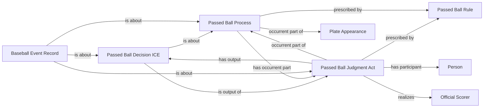

<!-- Generated by scripts/generate_rml_mermaid.py; do not edit. -->
<!-- Mapping SHA-256: 0525c6bf4b5afe22d7f8ed5ae6ba27fe96831e3a0765c0c3bf5a615539bc1189 -->

# Passed-ball scoring classification

A passed ball is an institutional scorer judgment, decision, rule, and counted process; the feed does not independently establish a physical pitch-ball control failure.

This view shows the ontology pattern without MLB JSON paths or RML machinery.

## RML evidence boundary

Generated from: `PassedBallProcessMap`, `PassedBallJudgmentMap`, `PassedBallDecisionMap`, `PassedBallRecordMap`, `PassedBallRuleMap`.
