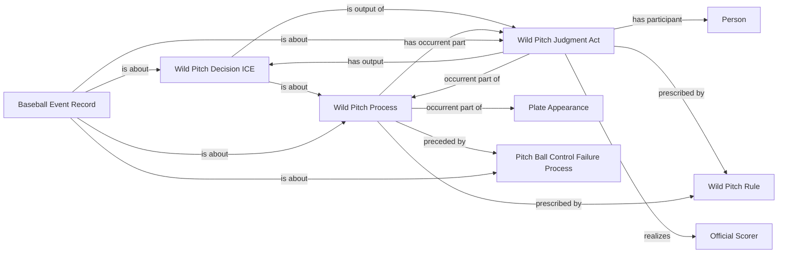

<!-- Generated by scripts/generate_rml_mermaid.py; do not edit. -->
<!-- Mapping SHA-256: 57a5cb1a54e46ee26b27f101cb1468292932df060b1f72c51331c0d029f8c2b5 -->

# Wild-pitch scoring classification

A wild pitch is a scorer judgment, decision, rule, and counted process downstream of a distinct physical pitch-ball control failure.

This view shows the ontology pattern without MLB JSON paths or RML machinery.

## RML evidence boundary

Generated from: `WildPitchProcessMap`, `WildPitchJudgmentMap`, `WildPitchDecisionMap`, `WildPitchRecordMap`, `WildPitchRuleMap`.
