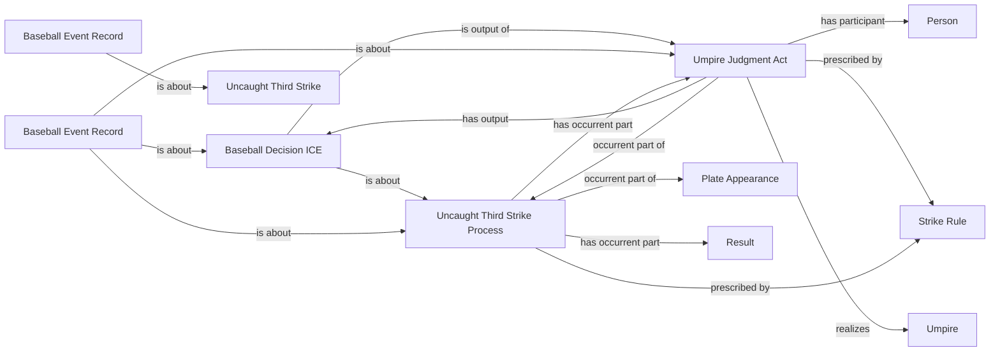

<!-- Generated by scripts/generate_rml_mermaid.py; do not edit. -->
<!-- Mapping SHA-256: 76b433db32acb7e8d69d7aeaabd0b6faa4e1973919c14b99d49047880065e471 -->

# Uncaught third strike and unresolved source placeholder

An uncaught third strike contains the strikeout and its own adjudication while MLB's null runner row remains an event record rather than becoming a fabricated physical failure, movement, or resolution.

This view shows the ontology pattern without MLB JSON paths or RML machinery.

## RML evidence boundary

Generated from: `UncaughtThirdStrikeProcessMap`, `UncaughtThirdStrikeJudgmentMap`, `UncaughtThirdStrikeDecisionMap`, `UncaughtThirdStrikeResultRecordMap`, `UncaughtThirdStrikePlaceholderRecordMap`.
