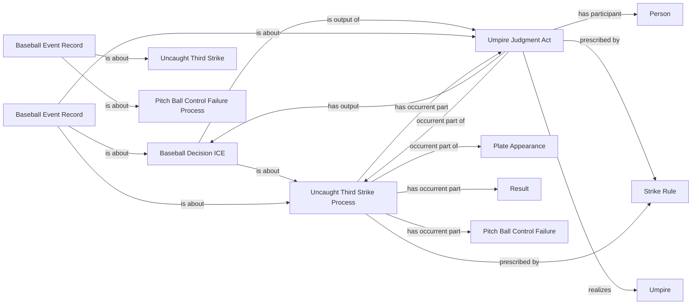

<!-- Generated by scripts/generate_rml_mermaid.py; do not edit. -->
<!-- Mapping SHA-256: 57a5cb1a54e46ee26b27f101cb1468292932df060b1f72c51331c0d029f8c2b5 -->

# Uncaught third strike and unresolved source placeholder

An uncaught third strike contains the strikeout, physical control failure, and its own adjudication while MLB's null runner row remains an event record rather than becoming a fabricated movement or resolution.

This view shows the ontology pattern without MLB JSON paths or RML machinery.

## RML evidence boundary

Generated from: `UncaughtThirdStrikeProcessMap`, `UncaughtThirdStrikeJudgmentMap`, `UncaughtThirdStrikeDecisionMap`, `UncaughtThirdStrikeResultRecordMap`, `UncaughtThirdStrikePlaceholderRecordMap`.
