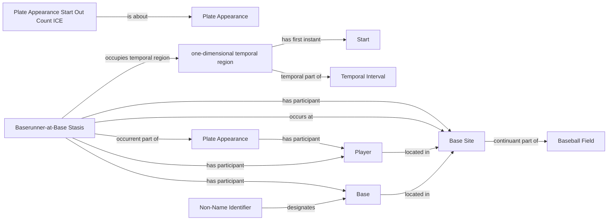

<!-- Generated by scripts/generate_rml_mermaid.py; do not edit. -->
<!-- Mapping SHA-256: 01f3efbccd0d2691d2b9ea22d2976ccca3e092a05a923e48639427281ac4ce8b -->

# Plate appearance start state

Each plate appearance records its starting out count; every occupied base contributes a runner participant, a base-scoped stasis, the physical Base, and the corresponding Base Site.

This view shows the ontology pattern without MLB JSON paths or RML machinery.

## RML evidence boundary

Generated from: `PlateAppearanceStartOutCountMap`, `PlateAppearanceStartRunnerParticipantMap`, `BaserunnerAtBaseStasisMap`, `BaserunnerAtBaseStasisIntervalMap`, `PlateAppearanceStartRunnerLocationMap`, `PlateAppearanceStartBaseArtifactMap`, `PlateAppearanceStartBaseIdentifierMap`, `PlateAppearanceStartBaseSiteMap`.
