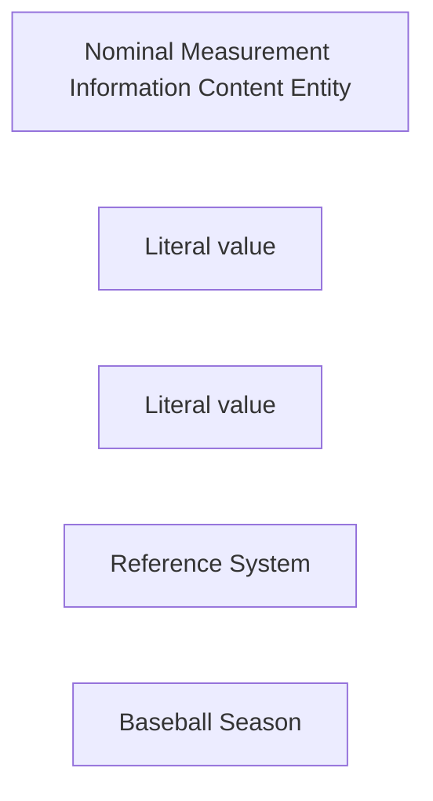

<!-- Generated by scripts/generate_rml_mermaid.py; do not edit. -->
<!-- Mapping SHA-256: a2469ac1f5a25943b6069f2873eb4b91992150a34aa29eb87cf656c8d5089893 -->

# Season and season phase

A game is an occurrent part of a reviewed season phase, the phase is an occurrent part of its season, and the provider category remains nominal evidence in a versioned Reference System.

This view shows the ontology pattern without MLB JSON paths or RML machinery.

## RML evidence boundary

Generated from: `SeasonMap`, `SeasonPhaseMap`, `GameSeasonPhaseMap`, `SeasonSegmentCategoryMap`, `SeasonSegmentReferenceSystemMap`.
