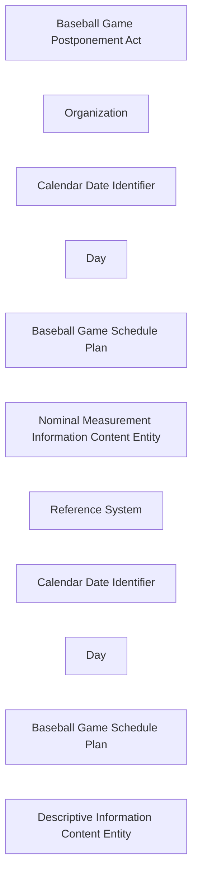

<!-- Generated by scripts/generate_rml_mermaid.py; do not edit. -->
<!-- Mapping SHA-256: 897a41688f0cd36aa8d0b3a8112c132b2c4a4f3e779505192f51b33870df8cea -->

# Game postponement and schedule revision

An official MLB declaration consumes an old game Schedule Plan and produces a distinct later Plan for the same game; Calendar Date Identifiers designate canonical Days, while the provider reason remains nominal evidence rather than an asserted weather cause.

This view shows the ontology pattern without MLB JSON paths or RML machinery.

## RML evidence boundary

Generated from: `SchedulePostponementActMap`, `MlbOrganizationMap`, `OriginalSchedulePlanMap`, `RevisedSchedulePlanMap`, `OriginalScheduleDateIdentifierMap`, `RevisedScheduleDateIdentifierMap`, `OriginalScheduleDayMap`, `RevisedScheduleDayMap`, `SchedulePostponementReasonMap`, `SchedulePostponementReasonReferenceSystemMap`, `ScheduleResponseEvidenceMap`, `ScheduleResponseReasonEvidenceMap`.
