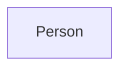

<!-- Generated by scripts/generate_rml_mermaid.py; do not edit. -->
<!-- Mapping SHA-256: 89fae0584eead88666541bd9f84897d45347f7ef9f863ecbfaff003daa8dccf1 -->

# Available game-official names

An official's stable identity is independent of whether this response supplies a name; a label is emitted only when MLB provides the name.

This view shows the ontology pattern without MLB JSON paths or RML machinery.

```mermaid
flowchart LR
    N01["Person"]
```

## RML evidence boundary

Generated from: `UmpirePersonLabelMap`.
