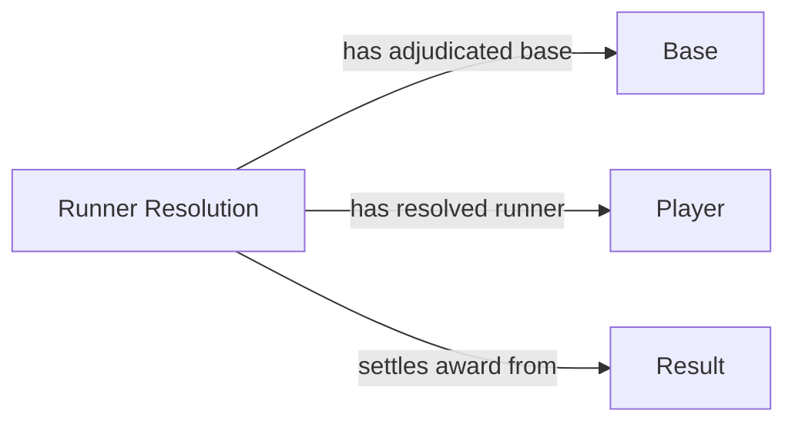

<!-- Generated by scripts/generate_rml_mermaid.py; do not edit. -->
<!-- Mapping SHA-256: 76b433db32acb7e8d69d7aeaabd0b6faa4e1973919c14b99d49047880065e471 -->

# Runner resolution and award links

A resolution identifies its runner; a supported Safe Process identifies its adjudicated Base; a completed direct or forced walk/HBP arrival settles its particular award without asserting continued entitlement or batter causation.

This view shows the ontology pattern without MLB JSON paths or RML machinery.

## RML evidence boundary

Generated from: `ResolvedRunnerLinkMap`, `AdjudicatedBaseLinkMap`, `AwardResolutionLinkMap`.
