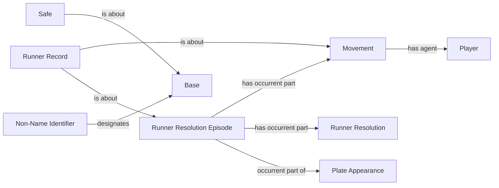

<!-- Generated by scripts/generate_rml_mermaid.py; do not edit. -->
<!-- Mapping SHA-256: f1f0054989fa91a76b8aa21a857f8b08cdeea24a88177e68a5ec0bb7ad0c493e -->

# Runner episode and safe decision destination

An episode pairs one baserunning act and resolution. The act has the runner as agent; the Safe Decision identifies the counted destination.

This view shows the ontology pattern without MLB JSON paths or RML machinery.

## RML evidence boundary

Generated from: `RunnerEpisodeMap`, `RunnerEpisodeAgentMap`, `RunnerEpisodeRecordMap`, `SafeDecisionDestinationMap`, `SafeDestinationIdentifierMap`.
