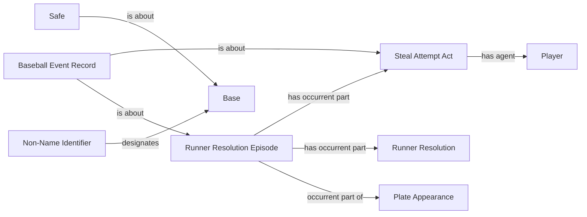

<!-- Generated by scripts/generate_rml_mermaid.py; do not edit. -->
<!-- Mapping SHA-256: 453de892549be95019b4529f875fbd86bd7bd073b32261dd717a096007cf3413 -->

# Runner episode and safe decision destination

An episode pairs one baserunning act and resolution. The act has the runner as agent; the Safe Decision identifies the counted destination.

This view shows the ontology pattern without MLB JSON paths or RML machinery.

```mermaid
flowchart LR
    N01["Safe"]
    N02["Plate Appearance"]
    N03["Steal Attempt Act"]
    N04["Runner Resolution Episode"]
    N05["Baseball Event Record"]
    N06["Runner Resolution"]
    N07["Player"]
    N08["Base"]
    N09["Non-Name Identifier"]
    N01 -->|is about| N08
    N03 -->|has agent| N07
    N04 -->|has occurrent part| N03
    N04 -->|has occurrent part| N06
    N04 -->|occurrent part of| N02
    N05 -->|is about| N03
    N05 -->|is about| N04
    N09 -->|designates| N08
```

## RML evidence boundary

Generated from: `RunnerEpisodeMap`, `RunnerEpisodeAgentMap`, `RunnerEpisodeRecordMap`, `SafeDecisionDestinationMap`, `SafeDestinationIdentifierMap`.
