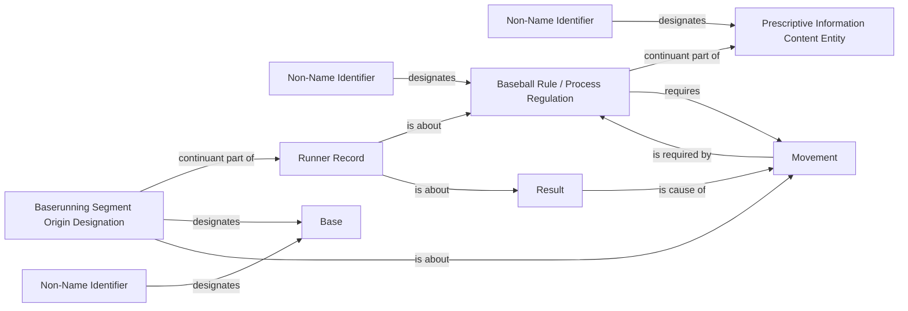

<!-- Generated by scripts/generate_rml_mermaid.py; do not edit. -->
<!-- Mapping SHA-256: bed3f052e82a896b8529c67b8e2a5c9746b06eef0788276d70bec48335fb63a4 -->

# Required award advances and source-designated segment origins

A walk/HBP causes only an evidenced exact award advance required by its applicable rule. A source origin designation identifies movement.start without asserting a stasis or continuity.

This view shows the ontology pattern without MLB JSON paths or RML machinery.

## RML evidence boundary

Generated from: `SegmentOriginDesignationMap`, `SegmentOriginBaseMap`, `SegmentOriginBaseIdentifierMap`, `AwardCauseMap`, `AwardRequirementMap`, `AwardRequiredByMap`, `AwardEvidenceRecordMap`, `AwardRuleEditionMap`, `AwardRuleIdentifierMap`, `AwardRuleEditionIdentifierMap`.
