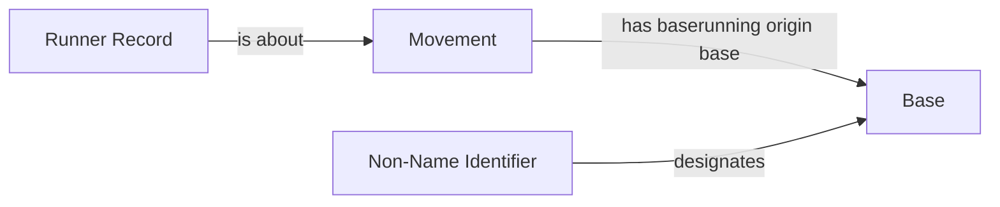

<!-- Generated by scripts/generate_rml_mermaid.py; do not edit. -->
<!-- Mapping SHA-256: 76b433db32acb7e8d69d7aeaabd0b6faa4e1973919c14b99d49047880065e471 -->

# Baserunning origin and explicit Base identifiers

The particular baserunning act identifies its corroborated origin Base and source record. Origin and adjudicated destination Bases have explicit categorical Code Identifiers; neither absence nor an IRI string supplies metric state.

This view shows the ontology pattern without MLB JSON paths or RML machinery.

## RML evidence boundary

Generated from: `BaserunningOriginLinkMap`, `BaserunningOriginBaseMap`, `BaserunningOriginIdentifierMap`, `BaserunningOriginRecordMap`, `AdjudicatedBaseIdentifierMap`.
