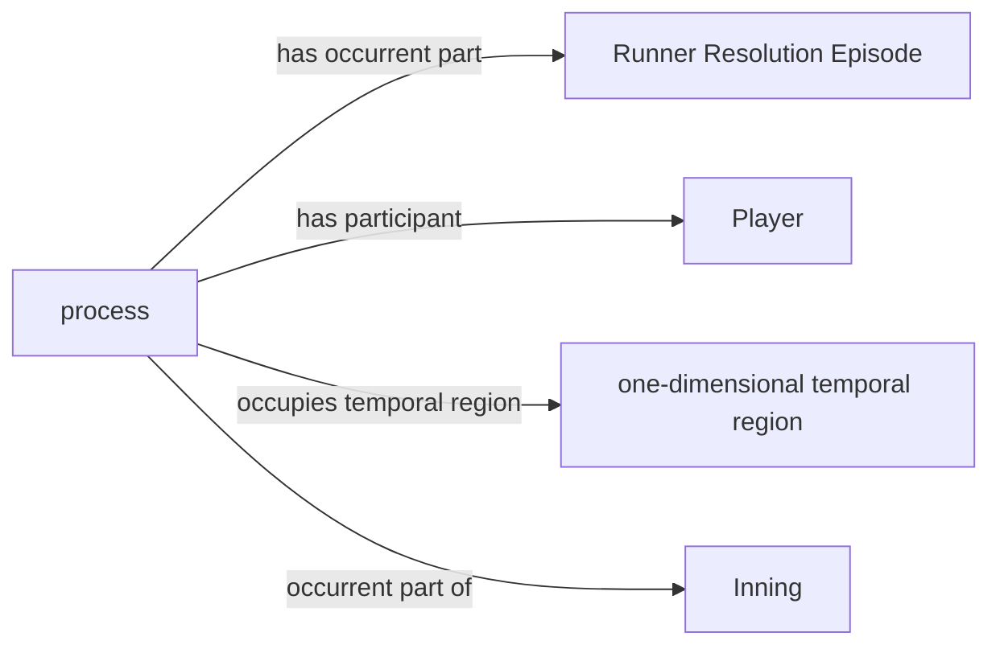

<!-- Generated by scripts/generate_rml_mermaid.py; do not edit. -->
<!-- Mapping SHA-256: a2469ac1f5a25943b6069f2873eb4b91992150a34aa29eb87cf656c8d5089893 -->

# Source-reconciled personal runner lifetime

The accepted C1 BFO Process contains the complete supported episode membership for one runner in one half inning, occupies its own interval and inherits no agency or role realization.

This view shows the ontology pattern without MLB JSON paths or RML machinery.

## RML evidence boundary

Generated from: `PersonalRunnerProcessMap`, `PersonalRunnerIntervalMap`, `PersonalRunnerMembershipMap`.
