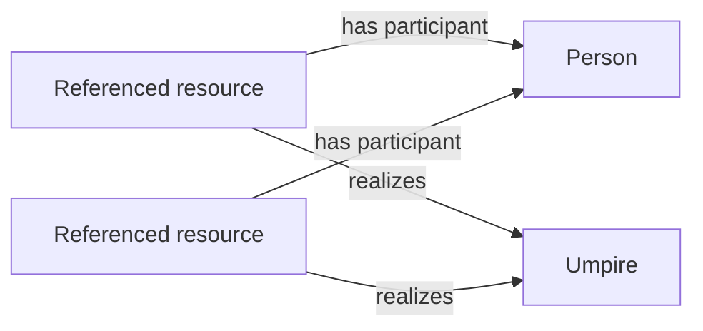

<!-- Generated by scripts/generate_rml_mermaid.py; do not edit. -->
<!-- Mapping SHA-256: cd4dda606e44e73c44bc725fccbd6e1b1ec28760bc7c60e9512e2eef68e0d508 -->

# Original pitch umpire attribution

An affirmed reviewed pitch retains the on-field umpire on the original judgment; the operative review judgment does not inherit that role.

This view shows the ontology pattern without MLB JSON paths or RML machinery.

```mermaid
flowchart LR
    N01["Referenced resource"]
    N02["Referenced resource"]
    N03["Person"]
    N04["Umpire"]
    N01 -->|has participant| N03
    N01 -->|realizes| N04
    N02 -->|has participant| N03
    N02 -->|realizes| N04
```

## RML evidence boundary

Generated from: `M2BallOnFieldAgencyMap`, `M2StrikeOnFieldAgencyMap`.
