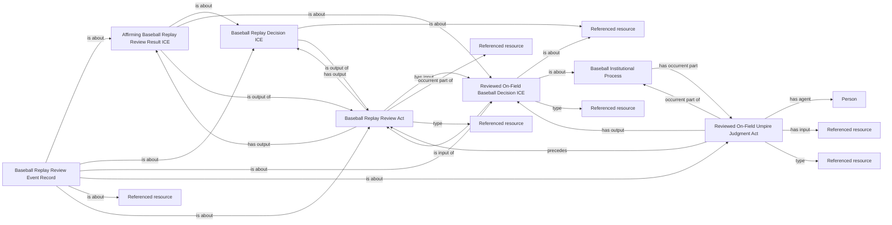

<!-- Generated by scripts/generate_rml_mermaid.py; do not edit. -->
<!-- Mapping SHA-256: bed3f052e82a896b8529c67b8e2a5c9746b06eef0788276d70bec48335fb63a4 -->

# Affirmed review of a particular called pitch

The operative pitch judgment is the review act. Distinct original and operative decisions concern the same pitched motion; one counted result and reconciled review identity are retained.

This view shows the ontology pattern without MLB JSON paths or RML machinery.

## RML evidence boundary

Generated from: `M2OperativeReviewMap`, `M2OperativeDecisionMap`, `M2OriginalJudgmentMap`, `M2OriginalDecisionMap`, `M2OriginalProcessMap`, `M2DispositionMap`, `M2RecordMap`.
