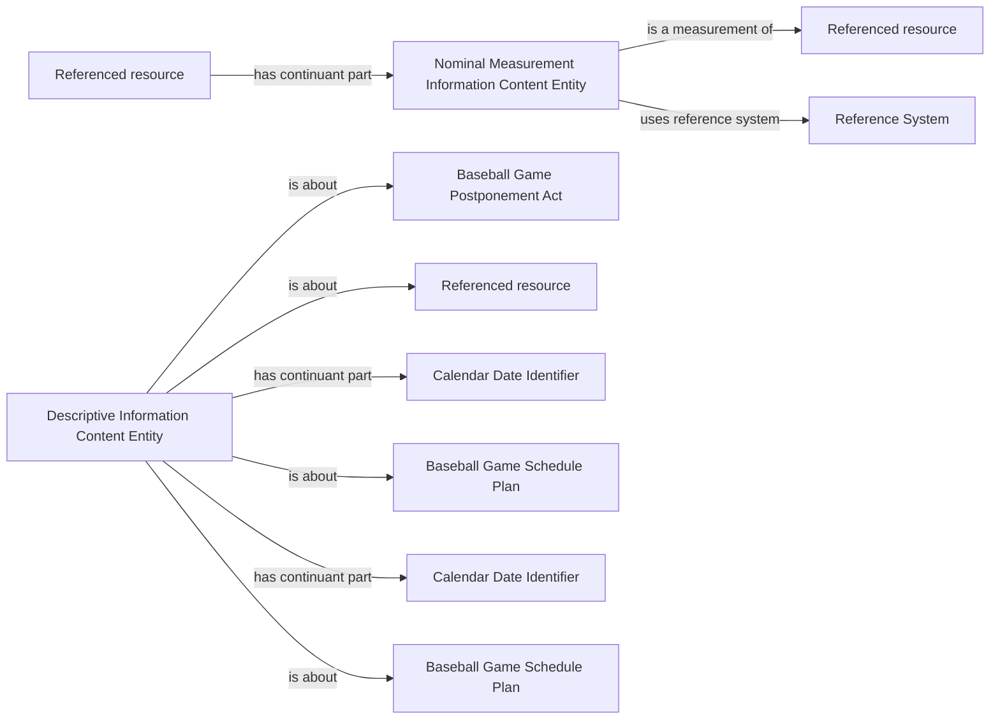

<!-- Generated by scripts/generate_rml_mermaid.py; do not edit. -->
<!-- Mapping SHA-256: 475f4c47f3b0bb3941dc4380421823ad817aec29e827ff53c3a606a354c62018 -->

# Postponement source and reason evidence

Existing schedule-response evidence and nominal reason classification, separated from the schedule revision view to keep both diagrams readable.

This view shows the ontology pattern without MLB JSON paths or RML machinery.

## RML evidence boundary

Generated from: `SchedulePostponementReasonMap`, `SchedulePostponementReasonReferenceSystemMap`, `ScheduleResponseEvidenceMap`, `ScheduleResponseReasonEvidenceMap`.
