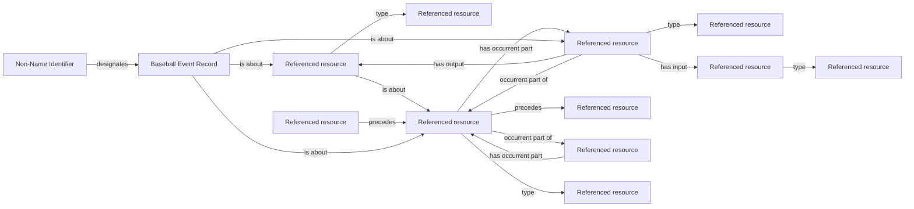

<!-- Generated by scripts/generate_rml_mermaid.py; do not edit. -->
<!-- Mapping SHA-256: 8c345042ecb2958d80d8fed5ce06613c31a202b499d928f3fbad5f6be2d4170c -->

# Automatic count awards without pitches

An evidenced timer penalty contributes one counted Ball or Strike Process, with a distinct judgment, decision and source record; it contributes no Pitch Act.

This view shows the ontology pattern without MLB JSON paths or RML machinery.

## RML evidence boundary

Generated from: `AutomaticCountProcessMap`, `AutomaticCountPAContainmentMap`, `AutomaticCountJudgmentMap`, `AutomaticCountDecisionMap`, `AutomaticCountRuleMap`, `AutomaticCountRecordMap`, `AutomaticCountRecordIdentifierMap`, `AutomaticCountPriorPitchMap`, `AutomaticCountNextPitchMap`.
