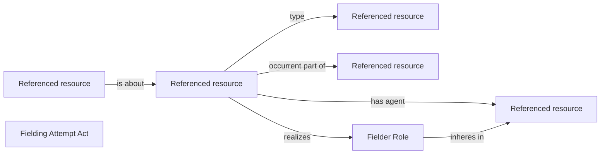

<!-- Generated by scripts/generate_rml_mermaid.py; do not edit. -->
<!-- Mapping SHA-256: bed3f052e82a896b8529c67b8e2a5c9746b06eef0788276d70bec48335fb63a4 -->

# Source-supported defensive performances

Distinct described performances have actual agents and their persistent Fielder Roles within a batted-ball play. Catch attempts retain one identity under fielding superclass typing. Narrative serialization does not assert precedence.

This view shows the ontology pattern without MLB JSON paths or RML machinery.

## RML evidence boundary

Generated from: `DefensiveActMap`, `DefensiveCatchFieldingMap`, `DefensiveRoleMap`, `DefensiveRecordMap`.
