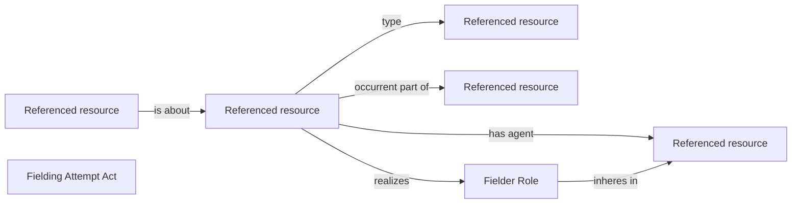

<!-- Generated by scripts/generate_rml_mermaid.py; do not edit. -->
<!-- Mapping SHA-256: cd4dda606e44e73c44bc725fccbd6e1b1ec28760bc7c60e9512e2eef68e0d508 -->

# Source-supported defensive performances

Distinct described performances have actual agents and their persistent Fielder Roles within a batted-ball play. Catch attempts retain one identity under fielding superclass typing. Narrative serialization does not assert precedence.

This view shows the ontology pattern without MLB JSON paths or RML machinery.

```mermaid
flowchart LR
    N01["Referenced resource"]
    N02["Referenced resource"]
    N03["Referenced resource"]
    N04["Referenced resource"]
    N05["Referenced resource"]
    N06["Fielder Role"]
    N07["Fielding Attempt Act"]
    N01 -->|has agent| N02
    N01 -->|occurrent part of| N04
    N01 -->|realizes| N06
    N01 -->|type| N03
    N05 -->|is about| N01
    N06 -->|inheres in| N02
```

## RML evidence boundary

Generated from: `DefensiveActMap`, `DefensiveCatchFieldingMap`, `DefensiveRoleMap`, `DefensiveRecordMap`.
