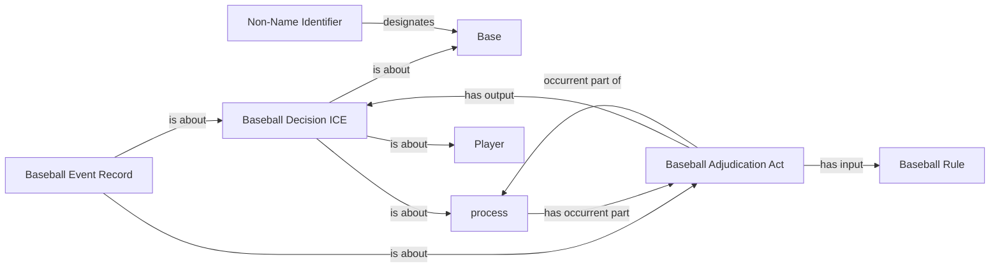

<!-- Generated by scripts/generate_rml_mermaid.py; do not edit. -->
<!-- Mapping SHA-256: 0525c6bf4b5afe22d7f8ed5ae6ba27fe96831e3a0765c0c3bf5a615539bc1189 -->

# Distinct extra-inning placement adjudication

A placement judgment begins the personal history, including one with no movement. Its decision concerns that whole, runner and second base; it is never a running act, Safe judgment or credited advance.

This view shows the ontology pattern without MLB JSON paths or RML machinery.

## RML evidence boundary

Generated from: `RunnerPlacementJudgmentMap`, `RunnerPlacementMembershipMap`, `RunnerPlacementDecisionMap`, `RunnerPlacementBaseMap`, `RunnerPlacementBaseIdentifierMap`, `RunnerPlacementRuleMap`, `RunnerPlacementRecordMap`.
