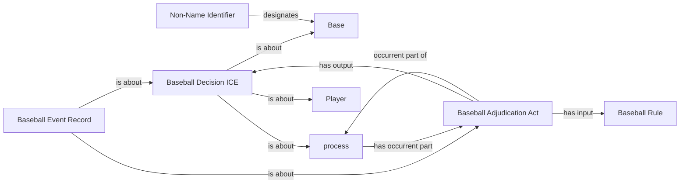

<!-- Generated by scripts/generate_rml_mermaid.py; do not edit. -->
<!-- Mapping SHA-256: cd4dda606e44e73c44bc725fccbd6e1b1ec28760bc7c60e9512e2eef68e0d508 -->

# Distinct extra-inning placement adjudication

A placement judgment begins the personal history, including one with no movement. Its decision concerns that whole, runner and second base; it is never a running act, Safe judgment or credited advance.

This view shows the ontology pattern without MLB JSON paths or RML machinery.

```mermaid
flowchart LR
    N01["Base"]
    N02["Baseball Decision ICE"]
    N03["Baseball Adjudication Act"]
    N04["Baseball Event Record"]
    N05["Baseball Rule"]
    N06["process"]
    N07["Player"]
    N08["Non-Name Identifier"]
    N02 -->|is about| N01
    N02 -->|is about| N06
    N02 -->|is about| N07
    N03 -->|has input| N05
    N03 -->|has output| N02
    N03 -->|occurrent part of| N06
    N04 -->|is about| N02
    N04 -->|is about| N03
    N06 -->|has occurrent part| N03
    N08 -->|designates| N01
```

## RML evidence boundary

Generated from: `RunnerPlacementJudgmentMap`, `RunnerPlacementMembershipMap`, `RunnerPlacementDecisionMap`, `RunnerPlacementBaseMap`, `RunnerPlacementBaseIdentifierMap`, `RunnerPlacementRuleMap`, `RunnerPlacementRecordMap`.
