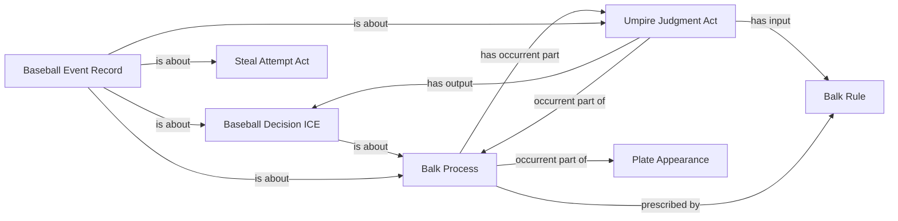

<!-- Generated by scripts/generate_rml_mermaid.py; do not edit. -->
<!-- Mapping SHA-256: cd4dda606e44e73c44bc725fccbd6e1b1ec28760bc7c60e9512e2eef68e0d508 -->

# Separate balk runner attribution

An explicitly joined operative balk shares one judgment and decision across its awarded runners, separate from the later PA result.

This view shows the ontology pattern without MLB JSON paths or RML machinery.

## RML evidence boundary

Generated from: `BalkAdvanceProcessMap`, `BalkAdvanceJudgmentMap`, `BalkAdvanceDecisionMap`, `BalkAdvanceRecordMap`.
