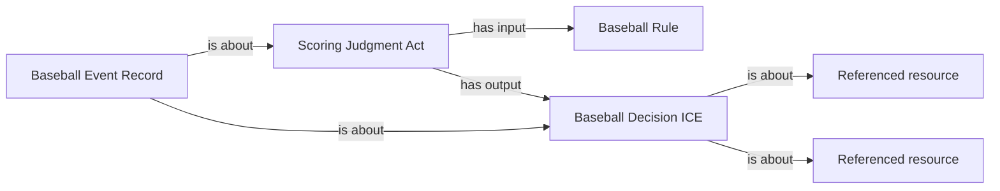

<!-- Generated by scripts/generate_rml_mermaid.py; do not edit. -->
<!-- Mapping SHA-256: b86d60ac423bd023ec39f89c839b4c882479b3c3016924fdbf4ad2fd754b765e -->

# Official RBI credit

Accepted EG4/EG5 scoring decisions remain distinct from actual participation and physical causation.

This view shows the ontology pattern without MLB JSON paths or RML machinery.

```mermaid
flowchart LR
    N01["Baseball Rule"]
    N02["Baseball Decision ICE"]
    N03["Scoring Judgment Act"]
    N04["Referenced resource"]
    N05["Baseball Event Record"]
    N06["Referenced resource"]
    N02 -->|is about| N04
    N02 -->|is about| N06
    N03 -->|has input| N01
    N03 -->|has output| N02
    N05 -->|is about| N02
    N05 -->|is about| N03
```

## RML evidence boundary

Generated from: `RBICreditJudgmentMap`, `RBICreditDecisionMap`, `RBICreditRecordMap`, `RBICreditRuleMap`.
