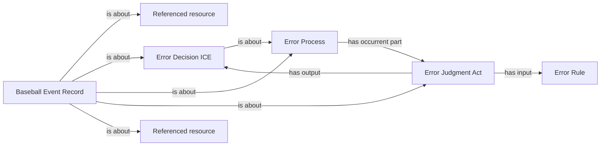

<!-- Generated by scripts/generate_rml_mermaid.py; do not edit. -->
<!-- Mapping SHA-256: cd4dda606e44e73c44bc725fccbd6e1b1ec28760bc7c60e9512e2eef68e0d508 -->

# Secondary scored errors

Accepted EG4/EG5 scoring decisions remain distinct from actual participation and physical causation.

This view shows the ontology pattern without MLB JSON paths or RML machinery.

## RML evidence boundary

Generated from: `SecondaryErrorProcessMap`, `SecondaryErrorJudgmentMap`, `SecondaryErrorDecisionMap`, `SecondaryErrorRecordMap`.
