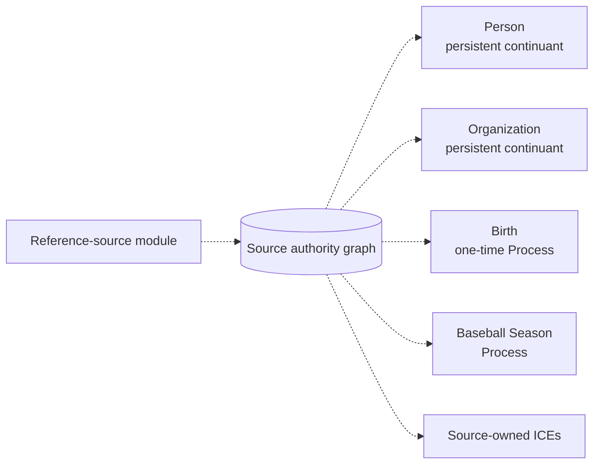
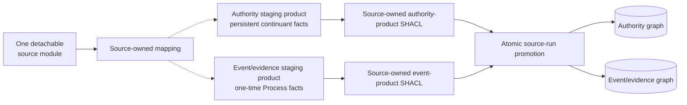
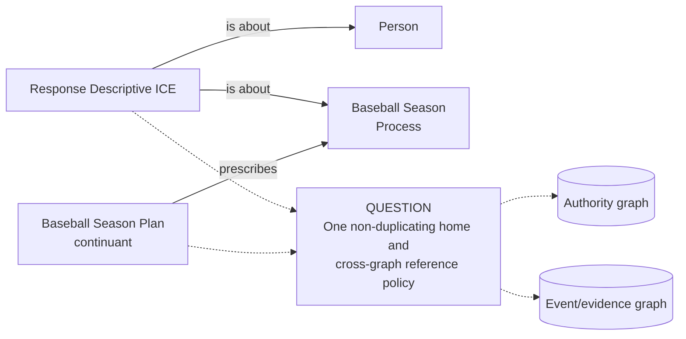

# Source-independent Mermaid

Status: **under review — design only**

These diagrams describe named-graph product choices. A box's placement does
not change its ontology type. Dashed arrows are pipeline routing, not RDF
object properties.

## Option A — source-owned authority record

Here `authority` means the authoritative reference record owned by the source.
It is not an assertion that every graph member is a persistent continuant.

## Option B — two products in one detachable module

The products validate separately but succeed or fail as one module run. The
module remains independently stoppable, retryable, and removable without
affecting another source lane.

## Shared evidence placement still requires an answer

The Plan and response are continuants even when they are about or prescribe a
Process. Their graph placement must not be inferred from the type of a related
entity.
