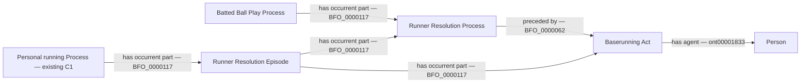

# B2: mixed-label continuations of one contact play

Status: draft, awaiting the ontologist. No new ontology terms, object
properties, personal-trajectory identities, source lane or metric formula.

## Concrete source and competency question

Game 824315, PA 6 in the immutable final feed
`data/raw/samples/2026-08-23/824315.json` (SHA-256
`5fcc75d37a20a516d312b3bfb3d5cefb4371ebafa639851ff16173d9b1a6607c`):
Angel Martinez singles, Nathaniel Lowe scores, Martinez is thrown out at
second, and Travis Bazzana finishes at third. Six runner rows share the
uniquely identified terminal in-play event:

| Row | Runner | Source classification | Segment |
| --- | --- | --- | --- |
| 0 | Martinez | single | batter origin to first, safe |
| 1 | Bazzana | single | first to second, safe |
| 2 | Bazzana | single | second to third, safe |
| 3 | Martinez | other_out | first toward second, out |
| 4 | Lowe | other_out | second to third, safe |
| 5 | Lowe | other_out | third to home, scored |

The existing C1 graph already groups the two rows for each runner in that
runner's personal Process. A1 links rows 0–2 to the Batted Ball Play but
deliberately omits the mixed `other_out` rows. Neither source absence nor
missing personal-trajectory identity explains this gap.

**May all six resolutions be occurrent parts of this one contact play under
the bounded continuation contract below?** With the already accepted final
terminal-state policy, Martinez receives no positive trajectory, Bazzana and
Lowe each supply one, and Offensive Reach for the PA is 2. A runner's
intermediate safe base does not survive that runner's terminal out as credit.

## Proposed bounded contract

1. Retain A1's completed recognized contact result, unique terminal in-play
   pitch, stable play identity, valid unfiltered event/runner indexes and
   source consistency requirements.
2. Admit mixed `other_out` runner rows only when the complete operative source
   sequence identifies them as continuations of that same contact play. A
   matching PA, numeric index or provider label alone is insufficient.
3. For initial executable coverage require all movement rows at that event to
   use the contact-result category or `other_out`, no conflicting action,
   substitution, unresolved review, independent running event or ball-control
   failure, and complete, nonbranching runner paths from existing C1 membership
   and segment origin/destination evidence. Conflicting or unsupported cases
   remain withheld as whole PAs; they are not omitted from the denominator.
4. Reuse the existing resolution, running-act, episode and personal-Process
   identities. Add only the existing BFO `has occurrent part` assertions from
   the existing Batted Ball Play to the supported existing resolutions. Do
   not add a direct batter-causes-runner relation or infer a new Act.
5. SHACL must reconcile exact supported membership and keep terminal outs,
   actual scored runs and multisegment paths. The accepted error/FC exclusion
   and independent steal/WP/PB policies remain. Source flags are proof inputs,
   not direct serving facts. Scores still come from RDF queries through SQL.

This is a named extension of A1's intentionally restricted source contract.
It is not implied by B1's approval of qualification. Executable RML must wait
until this decision is accepted and separately published.

## Field selection

| Evidence | Selection | Consequence |
| --- | --- | --- |
| Game/PA/play identity and unfiltered event index | Identity/join-only, already supplied | Retain exact scope; a join alone does not establish parthood. |
| Runner IDs, movement start/end/out and scoring result | Already mapped | Reuse resolution/episode and origin/destination evidence. |
| `other_out` rows sharing the operative contact sequence | Existing authoritative payload; mapping-coverage debt | Extend A1's explicit parthood only after B2 review. |
| C1 personal-Process membership | Already mapped for this example | Reuse identity; no new continuity policy. |
| Full source sequence and game totals | Already supplied | Independent completeness and ambiguity checks before admission. |

## Source-independent reviewed-vocabulary shape

The proposed change is membership in this existing shape, not a new relation.
The six source rows would continue to designate the existing six resolutions
and episodes and three personal Processes. Required focused proofs include
this positive example, safe-then-out, multiple safe segments counted once,
independent steal/WP/PB, conflicting event identity and missing terminal state.
