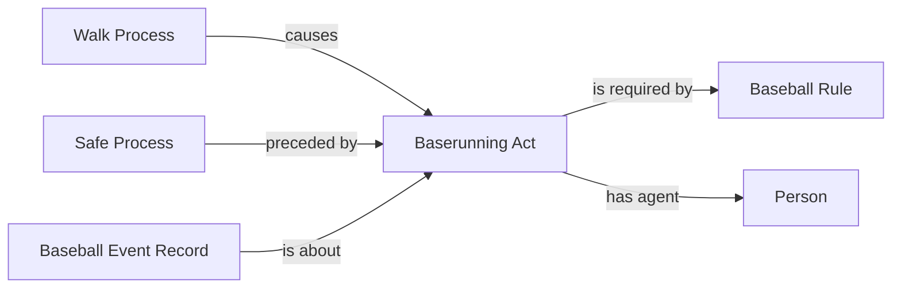

# W4: complete a walk awarded on automatic ball four

Status: **under review**. No executable mapping or semantic freeze is changed.

The automatic-count mapping already recognizes the final Ball Process in
game 822834, PA 31. The award selector then rejects the walk because that
event is not a physical pitch. This is coverage debt in the existing MLB-game
lane. The requested correction reuses the accepted walk award, running act,
safe outcome and rule pattern; it introduces no classes or properties.

## Exact proposed decision

Accept the existing `automatic_count_awards` selector's verified ball award
as an alternative terminal event for an ordinary walk. Require the same PA,
stable event identity and exact runner `playIndex`, a three-to-four ball
transition with unchanged strikes, the final walk result, and all current
batter/first-base/force-chain checks. Unsupported or contradictory reviews
still withhold the award. An arbitrary `isBall` flag or final result label
does not substitute for that verified automatic-count selection.

Continue mapping thrown-pitch walks through their existing path. Preserve
the distinction between the automatic Ball Process and a physical pitch.
Reuse the existing award maps; add only missing award triples and exact
dependencies for matching games in the accepted EG1 inventory. Future ordinary
ingestion uses the corrected generic selector. Do not replace game graphs,
reacquire other games, or rebuild the corpus.

The scope includes the necessary source-owned SHACL regression, a positive
fixture and negative cases, the targeted worker's bounded retry of an older
`already-present` receipt when this selected scope changes, and a scoped
semantic-freeze/context compatibility update naming this decision. Existing
unaffected proof implementations must remain reusable. No other selector or
ontology term changes are included.

## Retained source evidence

| Field | Observed value |
| --- | --- |
| Game / PA | 822834 / 31 |
| Source SHA-256 | `548dc0d1f394a6b757c0ac462c822df835e81761826e9bb57653a0f6ae1d4da0` |
| Result / batter | Walk / Alejandro Kirk, 672386 |
| Final event index / play ID | 5 / `22a38d08-a183-4def-836c-5426f1ca547a` |
| Final event | `type=no_pitch`, `isPitch=false`, call `VP`, pitcher pitch-timer violation |
| Accepted automatic-count selection | Ball; three balls to four, one strike unchanged; supported clock order |
| Runner record | Same batter, `playIndex=5`, null start, safe first-base destination, no movement reason |
| Post-play first-base occupant | `matchup.postOnFirst.id=672386` |
| Current award selector output | Empty |

The retained response lives under the state root at
`pipeline/quarantine/mlb-game/822834/targeted-eg1/input.json`; preserve its
bytes and hash through the normal promotion/retirement policy. The existing
Ball Process IRI is
`https://baseballontology.org/data/game/822834/process/ball/22a38d08-a183-4def-836c-5426f1ca547a`.

MLB confirms that a pitcher timer violation adds an automatic ball.
[MLB pitch-timer rules](https://www.mlb.com/glossary/rules/pitch-timer).
The user already accepted automatic ball/strike judgments; this request
extends only the frozen walk-award source selection to that existing meaning.

## Field selection inventory

| Existing evidence | Classification | Use |
| --- | --- | --- |
| Automatic Ball Process, judgment, decision and count transition | Already supplied | Reuse the accepted automatic-count selection |
| PA, play ID, event index and runner identity | Identity/join-only | Match the exact existing referents |
| Final walk, destination, `postOnFirst` and force flags | Already supplied | Existing award checks and dependencies |
| Missing award-to-running-act/rule links | Coverage debt | Existing award maps only |
| Unreconciled review or unmatched automatic event | Unresolved | Keep withheld |

## Competency questions and unchanged world-side pattern

1. Can an accepted automatic fourth Ball Process complete the counted walk
   without a physical pitch? Proposed answer: yes.
2. Does this license a missing cause or forced advance from a result label
   alone? No; exact accepted source selection and all existing joins remain.
3. Can unrelated RDF or other mapping selections change? No.

All nodes and relations reuse the accepted award/origin pattern. The Ball
Process already exists independently; no new edge is asserted merely because
it appears in this review diagram.
