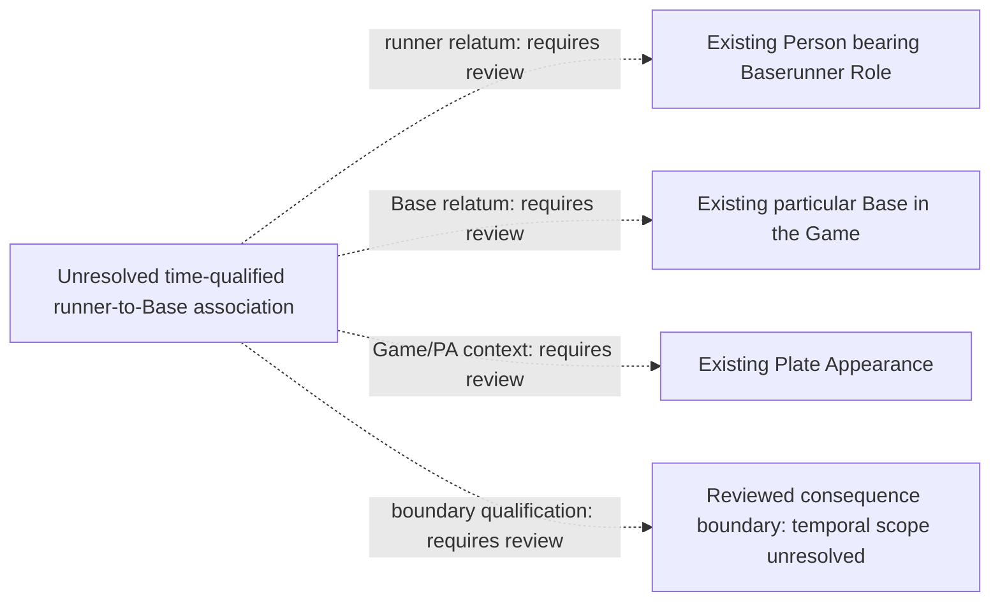

# Unchanged and stranded runners: concrete evidence gap

Status: **unresolved semantic boundary**, 2026-09-08. This adds evidence to A3,
A5 and A6, not an accepted ontology assertion or a complete-transition rule.

The user has since accepted the [boundary-association direction](../../archive/design-records/baserunner-boundary-association/decision.json):
base association at an evidenced boundary is distinct from continuously
standing on the Base. The user also emphasized required contact. The exact
relation, temporal qualification and connection to any evidenced touching
process still need review. This does not convert the unresolved diagram below
into an accepted ontology pattern.

The user then [confirmed](../../archive/design-records/baserunner-association-contact-evidence/decision.json)
that recognized association may be represented without evidence documenting
the particular touch. Physical-contact evidence remains separate; no touch
or missed touch is inferred. Temporal qualification and the exact ontology
pattern still require review.

The bounded inspection uses eight PA records in checked-in game 824315.
[Exact selected source fields](boundary-state-evidence.json) preserve whether
each post-base field is present or omitted. The source hash is
`5fcc75d37a20a516d312b3bfb3d5cefb4371ebafa639851ff16173d9b1a6607c`.

## Positive observations and limits

| PA pair | Explicit source evidence | What remains unproved |
| --- | --- | --- |
| 3 to 4, top first | Runner 663993 appears in `postOnFirst` in both records. PA 4 has only the batter's strikeout row; PA outs change 1 to 2. | Two matching post-PA observations do not establish the runner's immediate state before the terminal pitch or an uninterrupted interval between observations. |
| 29 to 30, bottom third | Runner 650489 appears in `postOnSecond` in both records. PA 30 has only the batter's strikeout row; PA outs change 0 to 1. | Same limitation, at second base. |
| 34 to 35, top fourth | Runner 800050 appears in `postOnThird` in both records. PA 35 has only the batter's strikeout row; PA outs change 1 to 2. | This is a concrete candidate for the accepted third-base erosion example, not a proven metric fixture yet. |
| 15 to 16, top second | PA 15 names 666176 at second and 800050 at third. PA 16 records only the batter's third out and omits all three post-base fields. | Omission is not evidence that these runners scored, were put out, or had no remaining opportunity. The accepted stranded-runner erosion policy still needs evidenced pre-consequence state and completeness. |

For PA 35 the terminal pitch's `count.outs` is 1, while the PA count is 2
and the batter runner row's `outNumber` is 2. For PA 16 those values are 2,
3 and 3. The event-local field cannot simply be renamed "outs after event".
These examples do not prove a universal alternative temporal interpretation.

## Field selection

| Fields | Selection | Bounded use |
| --- | --- | --- |
| `gamePk`, `about.atBatIndex`, inning and half | Identity/join-only | Keep observations within their actual PA and half inning. Adjacency alone does not prove continuity. |
| `matchup.postOnFirst/Second/Third.id` | Already supplied | Positive provider reports at a post-PA boundary; missing fields stay unknown. World-side runner/Base/boundary relation remains unresolved. |
| `runners[].movement`, runner ID and event index | Already supplied / identity join | Reuse accepted act origins, destinations and explicit resolutions when supported. No row does not license a fabricated Act or Safe Process. |
| PA and event `count.outs`; runner `outNumber` | Already supplied | Preserve each field's distinct context. Complete immediate-before counts and operative out identity remain under review. |
| Uninterrupted state and complete transition history | Unresolved | Not deterministically supplied by matching endpoints or missing runner rows. No extra provider field is assumed. |

## World-side shape still needed

This diagram identifies required relata; it does not introduce an ontology
class, reified information record or executable property. The ontology gap
cannot be filled by an ICE merely about those relata. The existing PA-start
physical-location Stasis, act-scoped origin and event-scoped safe adjudication
each retain their accepted meaning.

Before an implementation proposal can be admitted, the ontologist must select
the world-side relation and its temporal qualification. A separate evidence
contract must establish boundary placement and complete relevant transitions
before any unchanged or stranded classification is derived. Neither the
snapshot field nor a new relation alone proves that contract. Execution for
this field stops here; no semantic pin or runtime mapping is changed.

## Work available on accepted relations

[runner-movement-evidence.rq](../../sparql/metrics/runner-movement-evidence.rq)
now exposes each existing act/resolution pair with explicit runner, origin,
destination, source record, contact membership, award links and observed
resolution types. It preserves separate movements and missing values; it
neither supplies these absent boundary states nor awards metric credit.
