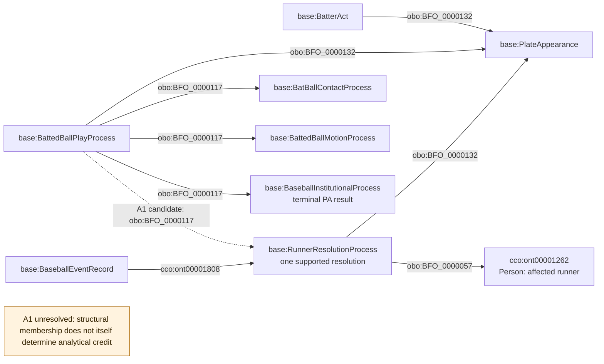
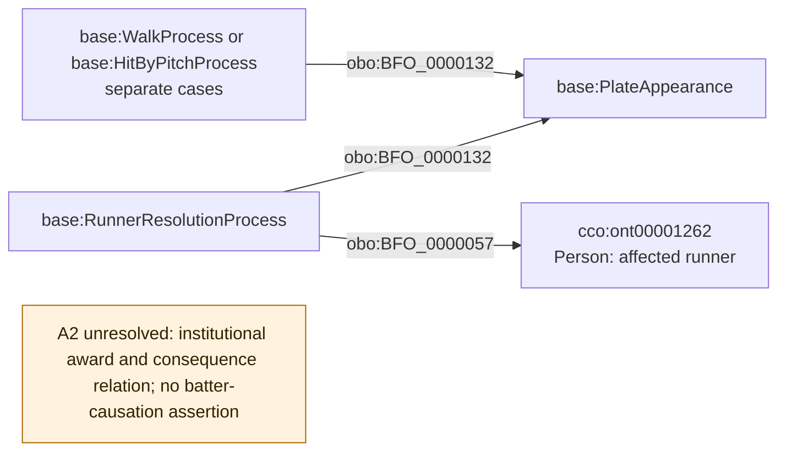
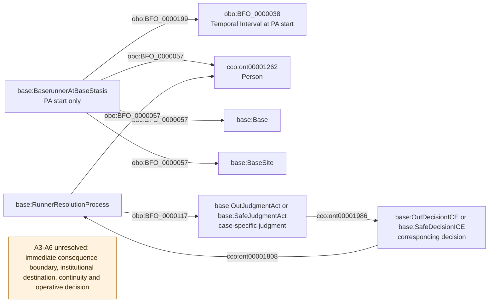
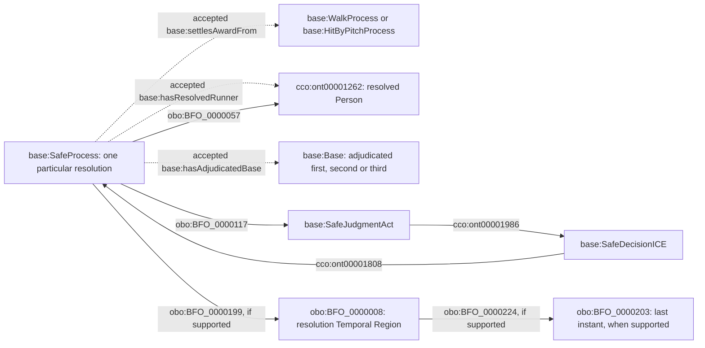

# Source-independent attribution review shapes

> Correction, 2026-09-09: passages below describing the four local runner
> properties are historical and withdrawn. Use the [structural correction](../../archive/design-records/runner-structural-correction/README.md).
> Episode/agent and decision-destination paths replace the first two shortcuts;
> directive prescription and stasis boundaries remain source-evidence gaps.

Nodes use accepted classes. Solid arrows show existing structural patterns;
dotted arrows are candidate assertions requiring review. A disconnected orange
note marks a gap, not an RDF individual, property, or executable substitute.
No generic Offensive Trajectory or Batter Consequence class is introduced.
The final section adds the concrete three-relation candidate prepared after
the original gap diagrams. Those three relations were subsequently accepted; the remaining state gaps are still under review.

The A1 parthood edge was subsequently accepted and implemented as a bounded
subset; its disposition is recorded in the
[accepted A1 decision](../../archive/design-records/mlb-game-batted-runner-resolution-containment/README.md).
The diagram below retains the original review candidate for context. The
remaining gaps do not become accepted through that partial disposition.

Prefixes: `base:` = `https://baseballontology.org/`; `obo:` =
`http://purl.obolibrary.org/obo/`; `cco:` =
`https://www.commoncoreontologies.org/`.

## A1. Contact play and its particular resolutions

The dotted arrow requires evidence that this resolution belongs to the
particular contact play. No arrow says that the entire PA causes each runner
resolution. Secondary errors and other mixed consequences require the
separate contribution decision. An independent steal remains outside the
candidate contact-play membership unless evidence supports otherwise.

## A2. Non-contact institutional result

The missing edge is intentional. CCO `is cause of` (`ont00001803`) is a
candidate relation only if the selected occurrent really causes the other.
It cannot stand for unreviewed metric credit. Review must determine whether
the award and runner resolution are distinct processes, overlapping parts,
or another accepted structure; shared source wording does not decide this.
Interference and uncaught-third-strike cases require their own evidence.

## A3-A6. State boundary, destination, and adjudication

The state on the left is the existing start-state pattern, not a proposed
terminal-state implementation. It has no realization edge. No `has output`
edge runs from the resolution to a pre-existing Base to imply destination.
No physical location, touching, or generic Spatial Region is substituted for
institutional safe status. A scored participant requires counted Run Process
evidence; a physical Home Plate alone does not mean a run counted.

The missing structures are blocking design questions. Their names in the
orange note provide no semantic implementation. Review must supply accepted
world-side anchors, relations and identity/temporal criteria before these
shapes can be completed and translated into source-specific mappings.

## Accepted A2/A4 slice: adjudicated destination and award completion

The new properties below are defined in
[resolution-links.ttl](../../archive/design-records/mlb-game-resolution-award-links/resolution-links.ttl); their evidence and interpretation
are specified in [resolution-links-review.md](../../archive/design-records/mlb-game-resolution-award-links/resolution-links-review.md).
This section supersedes the missing award/destination edges in the original
diagrams above. It does not resolve their immediate-before or completeness gaps.

The award edge applies only to the supported walk/HBP cases. A Safe Process
following a hit can have the same adjudicated-base and resolved-runner links
without an award edge. A forced scoring arrival uses a distinct Run Process
with a resolved-runner and award link; `hasAdjudicatedBase` is not used as a
substitute for counted-run semantics. Each resolution preserves its existing
PA and Game context. The diagram does not assert an exact timestamp merely
because an enclosing source event has one.

There is no Person-to-Base arrow whose time is supplied only by a label.
The Safe Process is the existing event-scoped intermediary. Its adjudicated
base does not assert continued physical occupancy or continued entitlement
afterward. The original PA-start location stasis is separate.
