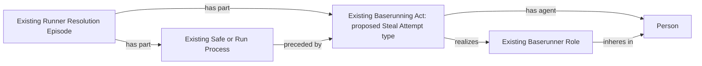

# D2: actual independent running during defensive indifference

Status: **under review**. No active mapping, metric policy or semantic pin changes.

The October 8 Empty Games remainder contains 82 selected PAs with a defensive-
indifference advance. The running act, runner, start, Safe/Run outcome and
destination already exist, but the metric cannot identify the independent
channel. An unrelated batter's later out consequently remains uncertain.
This is a diagnostic group, not a promise that 82 player-games will all resolve.

## Decision requested

Classify the existing, positively reconciled defensive-indifference running
act as the existing `base:StealAttemptAct`. Its accepted definition concerns
directed advancement during a pitch or related play without batted-ball
advancement; it does not require an official stolen-base award. This application
of the definition needs the ontologist's review. No definition is being changed.

The proposed addition is one `rdf:type` assertion per supported existing act.
Its existing Baserunner Role, person, episode, Safe/Run outcome and destination
remain intact. Do not create a Stolen Base Process, stolen-base judgment or
statistical stolen-base credit for defensive indifference. Do not add ontology
terms, object properties, exact clocks or a causal relation to the batter.

After acceptance, the existing independent-running reader gives any supported
positive advance to its runner. It gives none to the batter merely sharing that
PA. Existing terminal-out/coalescence rules still apply. This uses the accepted
Steal Attempt channel, not a new metric formula or a source-to-SQL shortcut.

MLB distinguishes defensive indifference from an official stolen base.
[MLB stolen-base glossary](https://www.mlb.com/glossary/standard-stats/stolen-base).
The proposed Act classification is a modeling judgment grounded in the existing
definition, not a classification asserted by that glossary.

## Exact selection and repair boundary

`check.py` contains the review-only selector. Require a completed PA; a matching
explicit `defensive_indiff` baserunning action and runner row; a single matching
event index; the same identified runner; `r_defensive_indiff`; a supported
forward base transition; a safe/scoring endpoint; no RBI; and the existing
runner-episode selection. Any review must pass the existing reconciler. Duplicate
identity, a contradictory endpoint, a batted/forced advance or an unrecognized
review does not select the act. No inference from the prose description alone.

After approval is recorded and published, add this generic selector to the
owning context builder and a single source-owned RML overlay map over its rows.
Reuse the common runner-act IRI: `game/{gamePk}/runner-act/movement/{pa}/{runnerIndex}`.
Update only its scoped context/mapping pins and compatible evidence ownership.
NiFi's existing EG1 worker may reopen a completed case only when it still has
an excluded approved player and this new selection matches its affected PA.
Use retained original input, or the existing EG1 bounded acquisition authority
when retired. Add only the absent type assertion and required existing
dependencies; run the owning source SHACL/admission stages and refresh affected
derived products. Preserve unrelated RDF. No whole-game or corpus replacement.
The generic selector must also handle future games.

`evidence.json` contains three exact retained selected-play excerpts and their
checkpoint hashes. They are review evidence, not reconstructed ingestion inputs.
The actual repair must use a separately hash-checked retained/acquired response.

| Source fields/pattern | Selection inventory | Purpose |
| --- | --- | --- |
| Event/runner `defensive_indiff` and movement reason | Already supplied; coverage debt | Identify independent attempted advancement |
| PA/event index, runner identity | Identity/join-only | Reuse the existing act |
| Movement endpoints, safe/scoring flags | Already supplied | Existing outcome and forward-progress checks |
| Review completion and disposition | Already supplied | Existing review reconciliation |
| Official stolen-base award | Not selected | Defensive indifference does not establish it |
| Missing or conflicting associations | Unresolved | Withhold this type assertion |

## Competency questions and unchanged graph structure

1. Is this an actual attempt to advance without a batted ball under the existing
   Steal Attempt definition even though no official stolen base is awarded?
   Proposed answer: yes, for the positively reconciled selection above.
2. Does the act benefit the batter? No; its supported progress is independent.
3. Can its later out be ignored to manufacture positive progress? No.
4. Does the mapping create a statistical stolen base? No.
5. Are errors, ambiguous replacement credit or unsupported reviews included?
   No; they retain their own unresolved scope.

All displayed relations and nodes already exist. Only the Act's additional
existing class membership is proposed. Source SHACL should check exactly that
selected membership and preserve all existing runner obligations.
