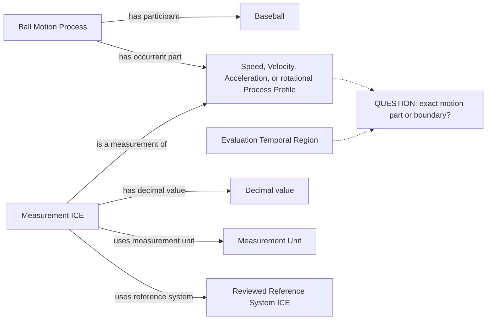
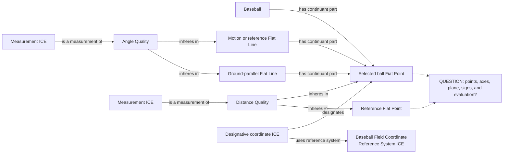
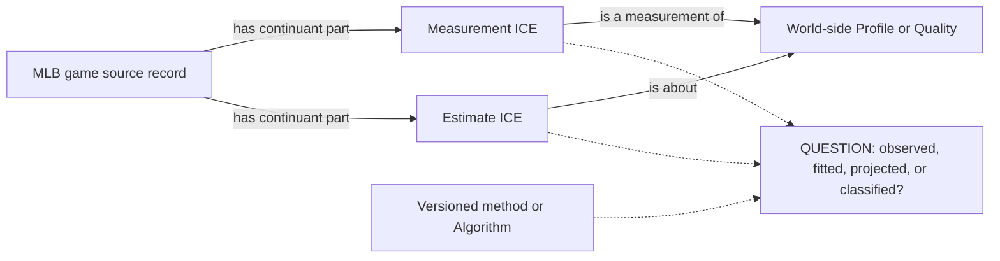
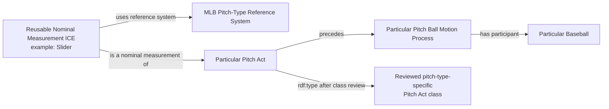
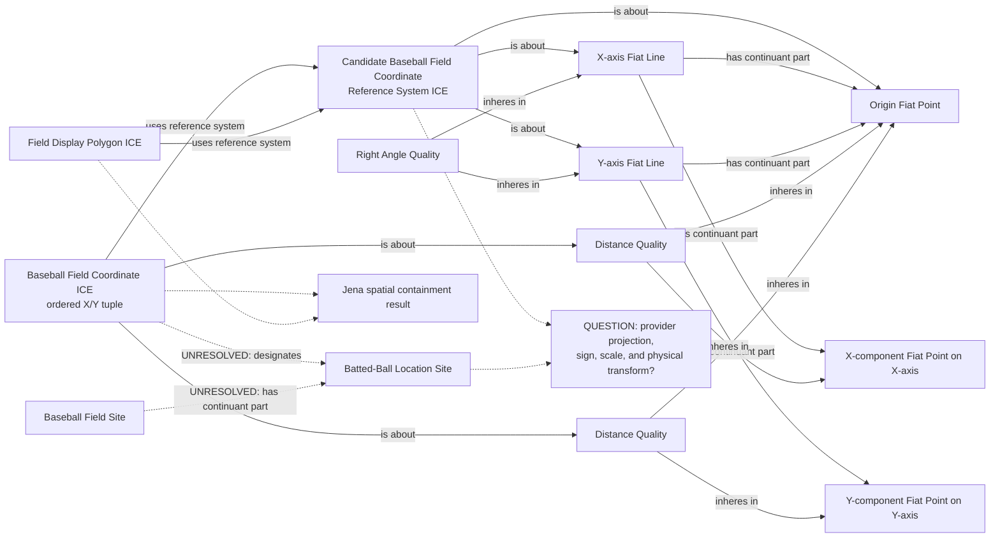

# Source-independent Mermaid

Solid edges use accepted vocabulary. Dotted edges expose unresolved structure.

The first three diagrams were accepted by the ontologist on 2026-08-31. The
classification pattern and strike-zone direction were subsequently accepted
and recorded in the corresponding archived design decision. Exact new class
definitions are now isolated in the focused pitch/batted-ball,
season/transaction-period, and strike-zone proposal packages. The revised
field-coordinate diagram remains under review and does not authorize RML.

## Reusable motion-measurement pattern

## Position, distance, and angle geometry

## Observed measurement versus provider estimate

## Accepted delta: reusable nominal pitch classification

`Slider`, `Cutter`, and similar provider categories are reusable information
content. They are not identifiers of individual pitches and they do not
replace either the intentional Pitch Act or the ensuing ball motion.

This applies to every genuine pitch type in the reviewed MLB pitch-type
catalog; `Slider` is only an example. Unknown, obsolete, or non-type provider
codes remain provider information and do not create world-side universals.
The exact Pitch Act and Batted-Ball Motion Process subclasses, definitions,
and axioms are in
[`baseball-pitch-and-batted-ball-classifications`](../../archive/design-records/baseball-pitch-and-batted-ball-classifications/)
archived design record.

## Review delta: provider-frame field coordinates without Spatial Regions

The public MLB/Savant description merely calls these hit coordinates X and Y.
It does not document a terrestrial coordinate reference system, physical unit,
origin, axes, orientation, or scale. The checked values therefore remain
provider-frame display coordinates. This proposal does not use CCO Spatial
Region or Coordinate System Axis classes. World-side axes are Fiat Lines that
meet at a shared Fiat Point; their perpendicularity is an Angle Quality.
Polygon containment is legitimate only when the point and polygon are
expressed under the same explicit provider convention.

The Angle Quality is the relational quality between the two axis Fiat Lines.
Each coordinate component is grounded in a Distance Quality between the origin
and a selected Fiat Point on its axis; the Reference System ICE supplies sign,
orientation, ordering, and scale conventions. The provider-to-world projection
remains unresolved. Until it is established, no Batted-Ball Location Site is
minted and no coordinate ICE designates a world-side Site. The Jena result is
information-space query evidence and must not turn an undocumented display
tuple into feet or a general geospatial coordinate.

`BaseballFieldCoordinateReferenceSystemICE` now subclasses the generic CCO
Reference System and is about the reviewed Fiat Line, Fiat Point, and Angle
Quality structure. That ontology repair does not resolve the provider contract:
origin, orientation, sign, scale, projection, polygon, and literal properties
remain blocked before this pattern is executable.

## Review delta: three-dimensional strike-zone site

The strike zone is modeled as a three-dimensional Site over Home Plate. Its
continuant parts include fiat boundary surfaces. A two-dimensional rendering
may depict a Fiat Surface, but that rendering is not the strike-zone Site in
reality.

```mermaid
flowchart TB
    ZONE[Candidate Strike Zone Site]
    FIELD[Baseball Field Site]
    PLATE[Home Plate]
    BATTER[Batter]
    UPPER[Upper batter-relative Fiat Surface]
    LOWER[Lower batter-relative Fiat Surface]
    LEFT[First-side Fiat Surface]
    RIGHT[Third-side Fiat Surface]
    FRONT[Front-of-plate Fiat Surface]
    BACK[Back-of-plate Fiat Surface]
    ABSPLANE[Candidate ABS Evaluation Fiat Surface<br/>midpoint of Home Plate]
    UPPERP[Selected upper-boundary Fiat Point]
    LOWERP[Selected lower-boundary Fiat Point]
    DATUM[Selected plate/ground datum Fiat Point]
    RULE[Strike-Zone Rule ICE]
    ABSRULE[ABS Evaluation Rule ICE]
    TOPQ[Distance Quality to upper boundary]
    BOTTOMQ[Distance Quality to lower boundary]
    TOPM[Top-boundary Measurement ICE]
    BOTTOMM[Bottom-boundary Measurement ICE]
    FRAME[Baseball Field Coordinate<br/>Reference System ICE]
    ANCHOR[QUESTION: exact anatomical and plate anchors,<br/>evaluation instant, and method era?]

    FIELD -->|has continuant part| ZONE
    ZONE -->|has continuant part| UPPER
    ZONE -->|has continuant part| LOWER
    ZONE -->|has continuant part| LEFT
    ZONE -->|has continuant part| RIGHT
    ZONE -->|has continuant part| FRONT
    ZONE -->|has continuant part| BACK
    ZONE -->|has continuant part| ABSPLANE
    UPPER -->|has continuant part| UPPERP
    LOWER -->|has continuant part| LOWERP
    PLATE -->|has continuant part| DATUM
    RULE -->|is about| ZONE
    ABSRULE -->|is about| ABSPLANE
    TOPQ -->|inheres in| UPPERP
    TOPQ -->|inheres in| DATUM
    BOTTOMQ -->|inheres in| LOWERP
    BOTTOMQ -->|inheres in| DATUM
    TOPM -->|is a measurement of| TOPQ
    BOTTOMM -->|is a measurement of| BOTTOMQ
    TOPM -->|uses reference system| FRAME
    BOTTOMM -->|uses reference system| FRAME
    PLATE -.-> ANCHOR
    BATTER -.-> ANCHOR
    UPPER -.-> ANCHOR
    LOWER -.-> ANCHOR
    LEFT -.-> ANCHOR
    RIGHT -.-> ANCHOR
    FRONT -.-> ANCHOR
    BACK -.-> ANCHOR
    ABSPLANE -.-> ANCHOR
```

The three-dimensional Site is the rulebook strike zone. The two-dimensional
Fiat Surface is a distinct evaluation structure used by the 2026 ABS challenge
system at the midpoint of Home Plate; it does not replace the Site. The solid
structure uses accepted classes and relations. `Strike Zone Site` and the
ABS-specific evaluation structure are candidate new BaseballO classes. The
dotted anchor structure remains blocked because the imported ontology has no
reviewed assertion here that identifies which anatomical fiat points set the
upper and lower surfaces or exactly how Home Plate fixes the vertical surfaces
and ABS plane. The provider's `strikeZoneTop` and `strikeZoneBottom` values
cannot fill that world-side gap by themselves.
