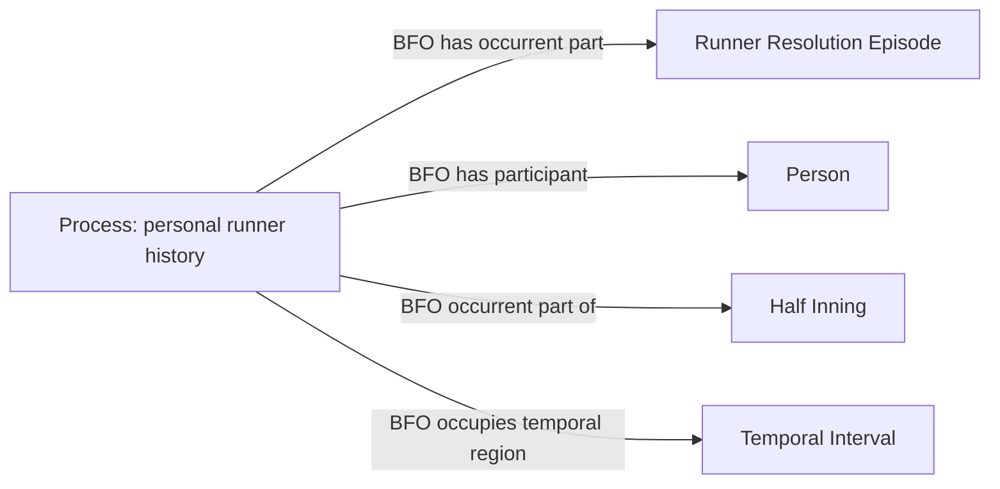

# Q7: isolate a pinch runner with no recorded movement

Status: under review. No implementation or ontologist approval is implied.
No new class, object property, data property or identity policy is proposed.

## Concrete defect and proposed correction

Two September 16 games contain a pinch runner who entered an existing base
and was stranded without a recorded running episode. The current context
builder records `ZERO_EPISODE_PERSONAL_HISTORY` for that person and consequently
withholds every runner's history in that half-inning. Another runner's complete
scoring history is therefore absent from the promoted RDF in each game.

Approve this bounded correction to the existing MLB-game history selection:

1. Keep the zero-episode person's proposed history withheld. Do not invent a
   movement, realization, stasis, time, or replacement role/act assertion.
2. When **the only half-inning issues** are these identified zero-episode
   histories, retain the other independently reconciled histories with one or
   more recorded episodes and their existing supported entry/end boundaries.
   Preserve the already reviewed identity keys and accepted C1 graph pattern.
3. Preserve every other history issue and its existing scope. Do not turn
   incomplete half-inning or PA-start coverage into complete metric coverage.
4. Repair the two named promoted games by adding only their missing supported
   history triples through the owning RML/SHACL/NiFi stages. Use the exact
   retained source-derived inventories, which still contain those candidates.
   Validate the resulting graph with the owning source profiles. Preserve all
   unrelated RDF; do not replace whole games, reacquire API data or rebuild a
   season. Rebuild only affected derived indexes/SQL products afterward.

This also applies prospectively in the same source lane when this exact
condition recurs. It does not authorize a corpus-wide replay of older games.
The scoring-run population must still include every counted run, and every
metric must still pass its own complete-input and participation requirements.

## Competency questions

- Does a replacement record establish an actual running episode? No.
- Does an empty episode list license a fabricated runner history? No.
- Does that one empty list invalidate another runner's independently reconciled
  scoring history in the same half-inning? Proposed answer: no, under the
  exact isolated-issue condition above.
- Can a review dispute, unknown movement, or invalid clock be ignored under
  this correction? No; their existing withholding remains.
- Does this certify all PA-start occupancy or the entire half-inning? No.

## Retained source evidence and field inventory

The exact input and retained-manifest hashes, omitted scorer histories, and
zero-episode counterparts are in [source-evidence.json](source-evidence.json).
The SQL reader identifies missing histories for run `822846/score/68/1` and
run `824467/score/53/3`. The existing RML manifests retain complete candidate
histories for those scorers. No provider evidence is newly requested.

| Existing field/product | Selection classification | Treatment |
| --- | --- | --- |
| Explicit runner/replacement IDs | Identity/join-only | Existing source-owned person identities |
| Personal episode membership and movement outcomes | Already supplied | Existing accepted runner episodes and resolutions |
| Supported entry/end anchors and temporal bounds | Already supplied | Preserve existing lifetime keys and temporal pattern |
| Empty episode list for the stranded pinch runner | Existing coverage debt | Withhold that history; infer no action |
| Complete other candidate histories in that half | Already supplied | Add only the omitted accepted C1 assertions after review |
| New times, inferred episodes or new predicates | Unresolved/not supplied | Do not assert |

## Source-independent shape

This reuses the accepted C1 structure and the same existing relations:

The diagram is a pattern for the supported nonempty histories. It does not
classify the zero-episode pinch runner's time at the base as a Process or Act.

## Implementation boundary after acceptance

Publish the named Q7 decision before changing the context selection, applicable
source SHACL or targeted RML execution. Encode exact selected-history membership
in the existing owning SHACL; do not duplicate semantic checks in a new gate.
NiFi owns the scoped fixture, graph validation, additive promotion and affected
serving updates. No ontology file or new vocabulary is needed.
