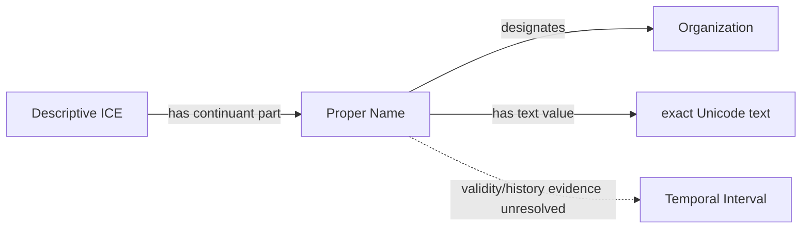

# Source-independent Mermaid

```mermaid
flowchart LR
    ORG[Organization]
    NAME[Proper Name]
    TEXT[exact Unicode text]
    RECORD[Descriptive ICE]
    INTERVAL[Temporal Interval]

    NAME -->|designates| ORG
    NAME -->|has text value| TEXT
    RECORD -->|has continuant part| NAME
    NAME -.->|validity/history evidence unresolved| INTERVAL
```

The dashed history edge is a question, not a new property.
