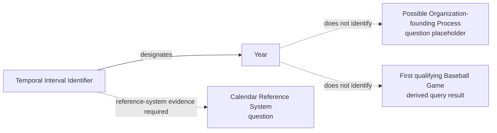

# Source-independent Mermaid

```mermaid
flowchart LR
    IDENTIFIER[Temporal Interval Identifier]
    YEAR[Year]
    SYSTEM[Calendar Reference System\nquestion]
    FOUNDING[Possible Organization-founding Process\nquestion placeholder]
    FIRSTGAME[First qualifying Baseball Game\nderived query result]

    IDENTIFIER -->|designates| YEAR
    IDENTIFIER -.->|reference-system evidence required| SYSTEM
    YEAR -.->|does not identify| FOUNDING
    YEAR -.->|does not identify| FIRSTGAME
```

Dashed branches are evidence questions or prohibited inferences.
