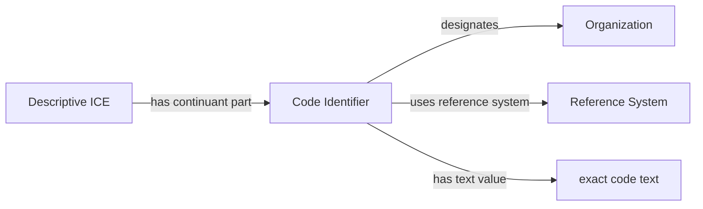

# Source-independent Mermaid

```mermaid
flowchart LR
    ORG[Organization]
    CODE[Code Identifier]
    SYSTEM[Reference System]
    TEXT[exact code text]
    RECORD[Descriptive ICE]

    CODE -->|designates| ORG
    CODE -->|uses reference system| SYSTEM
    CODE -->|has text value| TEXT
    RECORD -->|has continuant part| CODE
```

The generic shape does not decide which provider fields instantiate it.
