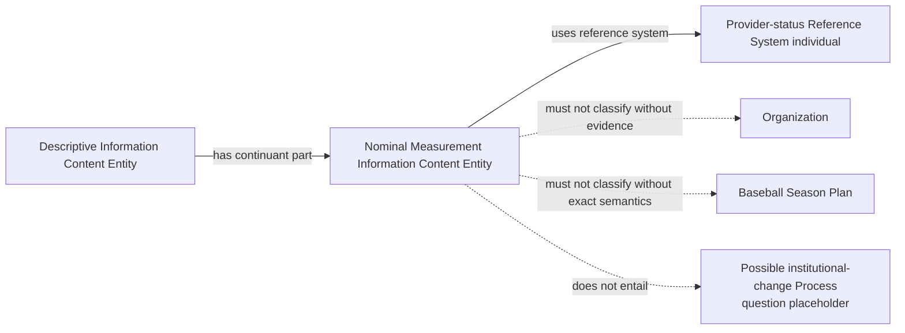

# Source-independent Mermaid

```mermaid
flowchart LR
    RECORD[Descriptive Information Content Entity]
    STATUS[Nominal Measurement Information Content Entity]
    SYSTEM[Provider-status Reference System individual]
    ORG[Organization]
    PLAN[Baseball Season Plan]
    CHANGE[Possible institutional-change Process\nquestion placeholder]

    RECORD -->|has continuant part| STATUS
    STATUS -->|uses reference system| SYSTEM
    STATUS -.->|must not classify without evidence| ORG
    STATUS -.->|must not classify without exact semantics| PLAN
    STATUS -.->|does not entail| CHANGE
```

Dashed branches are prohibited inferences, not proposed properties.
