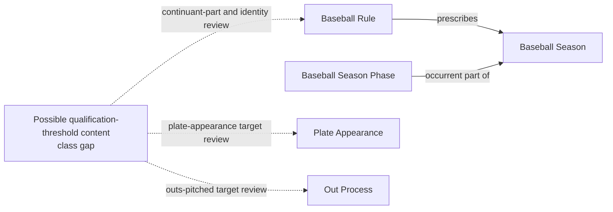

# Source-independent Mermaid

```mermaid
flowchart LR
    RULE[Baseball Rule]
    SEASON[Baseball Season]
    PHASE[Baseball Season Phase]
    PA[Plate Appearance]
    OUT[Out Process]
    THRESHOLD[Possible qualification-threshold content\nclass gap]

    RULE -->|prescribes| SEASON
    PHASE -->|occurrent part of| SEASON
    THRESHOLD -.->|continuant-part and identity review| RULE
    THRESHOLD -.->|plate-appearance target review| PA
    THRESHOLD -.->|outs-pitched target review| OUT
```

Dashed edges are unresolved content/target questions.
