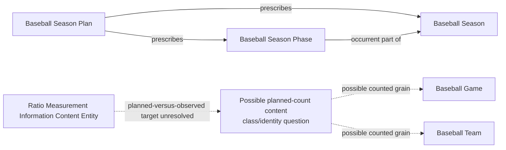

# Source-independent Mermaid

```mermaid
flowchart LR
    PLAN[Baseball Season Plan]
    SEASON[Baseball Season]
    PHASE[Baseball Season Phase]
    GAME[Baseball Game]
    TEAM[Baseball Team]
    VALUE[Ratio Measurement Information Content Entity]
    TARGET[Possible planned-count content\nclass/identity question]

    PLAN -->|prescribes| SEASON
    PLAN -->|prescribes| PHASE
    PHASE -->|occurrent part of| SEASON
    VALUE -.->|planned-versus-observed target unresolved| TARGET
    TARGET -.->|possible counted grain| GAME
    TARGET -.->|possible counted grain| TEAM
```

Dashed edges are mutually exclusive modeling questions.
