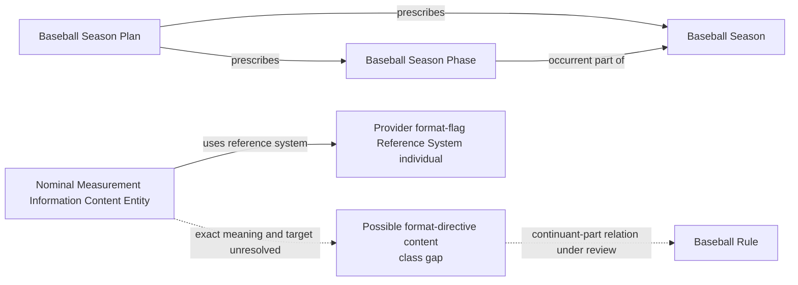

# Source-independent Mermaid

```mermaid
flowchart LR
    PLAN[Baseball Season Plan]
    SEASON[Baseball Season]
    PHASE[Baseball Season Phase]
    RULE[Baseball Rule]
    FLAG[Nominal Measurement Information Content Entity]
    SYSTEM[Provider format-flag Reference System individual]
    CONTENT[Possible format-directive content\nclass gap]

    PLAN -->|prescribes| SEASON
    PLAN -->|prescribes| PHASE
    PHASE -->|occurrent part of| SEASON
    FLAG -->|uses reference system| SYSTEM
    FLAG -.->|exact meaning and target unresolved| CONTENT
    CONTENT -.->|continuant-part relation under review| RULE
```

Dashed edges expose unresolved content identity; they are not new properties.
