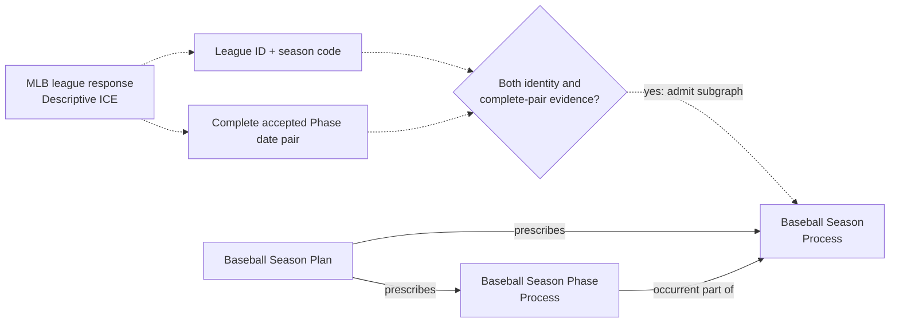
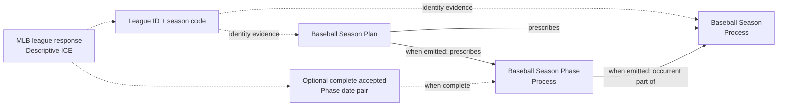
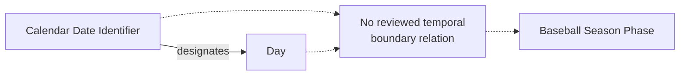

# Source-independent Mermaid

Status: **under review — design only**

The diagrams use only accepted classes and relations. Solid semantic edges are
candidate RDF for the corresponding option, not authorized triples. Dashed
arrows point to decision or evidence gates and are not object properties.

## Option A — complete-pair gate

If the complete pair is absent, none of `SEASON`, `PLAN`, or `PHASE` is
emitted from that response. The current SHACL minimum of one prescribed Phase
remains correct for every emitted Baseball Season Plan.

## Option B — season-code evidence with a locally incomplete graph

The absence of `PHASE` in one response graph is not an RDF assertion that the
Plan has no Phase. Source SHACL would allow zero locally asserted reviewed
Phases and continue to validate every Phase that is present.

## Invariants under both options

Neither option licenses a Date-to-Phase or Day-to-Phase edge, a partial-pair
Phase, or an institutional membership assertion.
