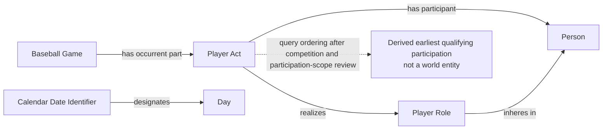

# Source-independent Mermaid

```mermaid
flowchart LR
    PERSON[Person]
    GAME[Baseball Game]
    ACT[Player Act]
    ROLE[Player Role]
    DATE[Calendar Date Identifier]
    DAY[Day]
    DEBUT[Derived earliest qualifying participation\nnot a world entity]

    GAME -->|has occurrent part| ACT
    ACT -->|has participant| PERSON
    ACT -->|realizes| ROLE
    ROLE -->|inheres in| PERSON
    DATE -->|designates| DAY
    ACT -.->|query ordering after competition and participation-scope review| DEBUT
```

The dashed query dependency is not a proposed RDF property.
