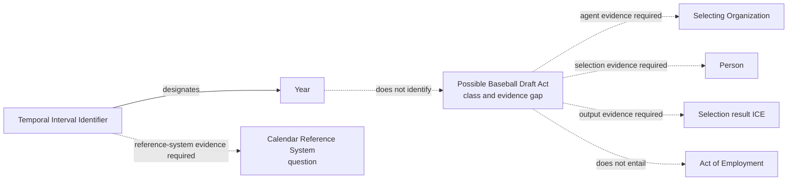

# Source-independent Mermaid

```mermaid
flowchart LR
    PERSON[Person]
    YEARID[Temporal Interval Identifier]
    YEAR[Year]
    SYSTEM[Calendar Reference System\nquestion]
    DRAFT[Possible Baseball Draft Act\nclass and evidence gap]
    ORG[Selecting Organization]
    RESULT[Selection result ICE]
    EMPLOYMENT[Act of Employment]

    YEARID -->|designates| YEAR
    YEARID -.->|reference-system evidence required| SYSTEM
    YEAR -.->|does not identify| DRAFT
    DRAFT -.->|agent evidence required| ORG
    DRAFT -.->|selection evidence required| PERSON
    DRAFT -.->|output evidence required| RESULT
    DRAFT -.->|does not entail| EMPLOYMENT
```

Dashed edges are questions or prohibited inferences, not proposed properties.
