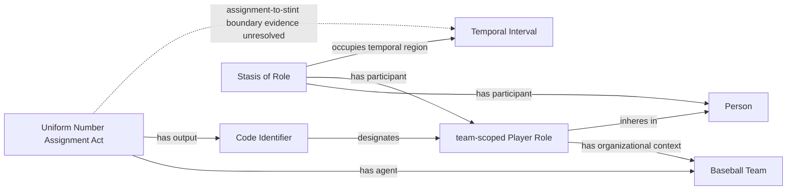

# Source-independent Mermaid

The solid shape is already accepted ontology. The dashed temporal branch is the
source-evidence gap.

The Stasis does not realize the Role. It represents persistence while the Role
and bearer participate.
