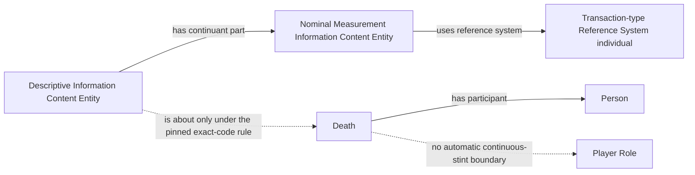

# Source-independent Mermaid

```mermaid
flowchart LR
    ROW[Descriptive Information Content Entity]
    TYPE[Nominal Measurement Information Content Entity]
    SYSTEM[Transaction-type Reference System individual]
    DEATH[Death]
    PERSON[Person]
    ROLE[Player Role]

    ROW -->|has continuant part| TYPE
    TYPE -->|uses reference system| SYSTEM
    ROW -.->|is about only under the pinned exact-code rule| DEATH
    DEATH -->|has participant| PERSON
    DEATH -.->|no automatic continuous-stint boundary| ROLE
```

The dashed Role edge is a prohibited inference.
